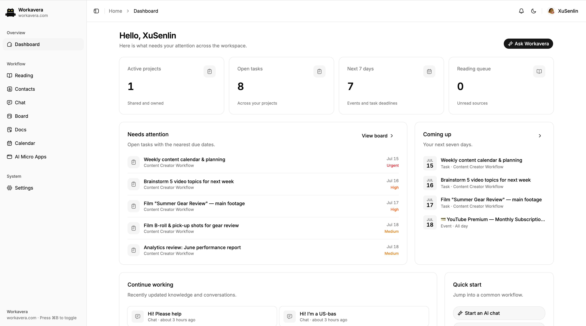
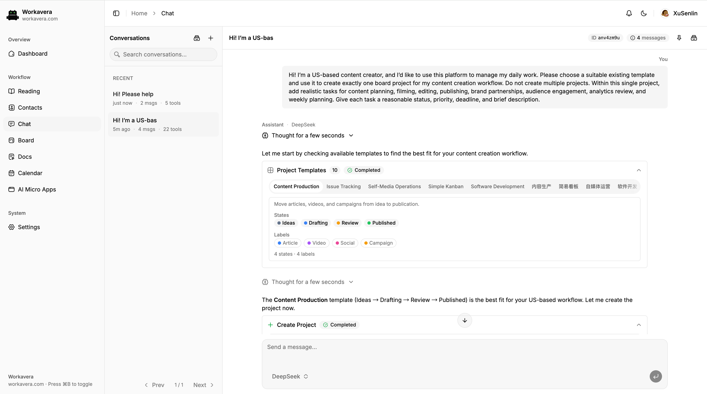
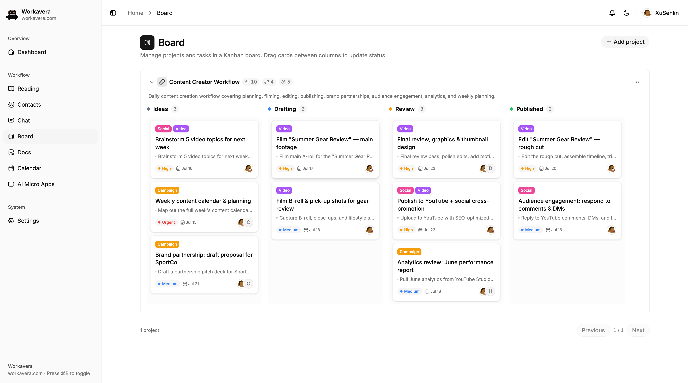
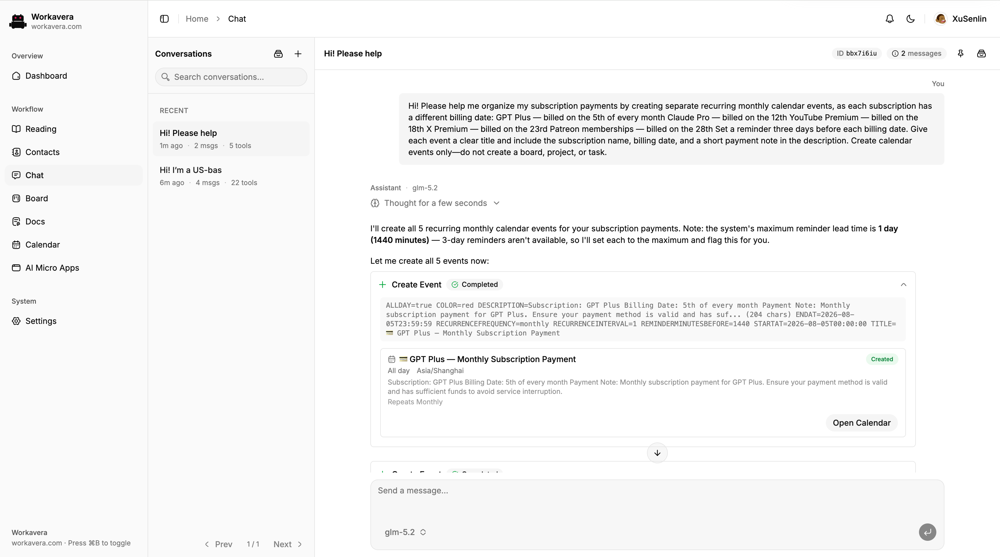
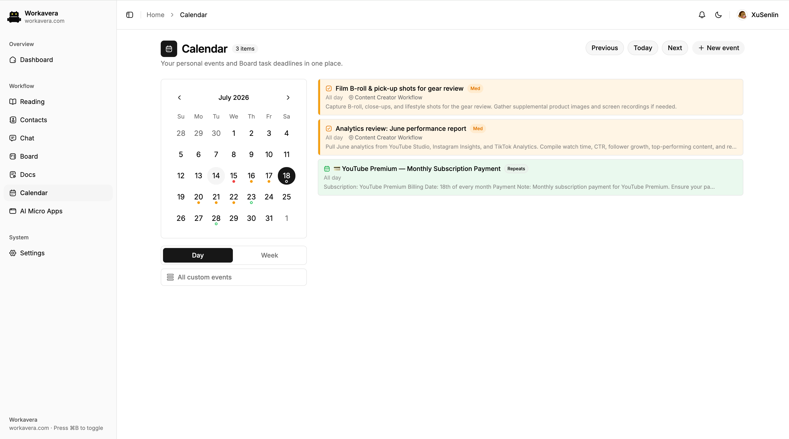

# Workavera

[](./LICENSE)

[简体中文](./README.zh-CN.md)

> **The AI-driven, open-source, self-hosted alternative to Slack + Notion + Linear** — one binary on your own server, your data, no per-seat fees.

> ⚠️ **Early-stage software (0.0.x).** Workavera is under active development: features and data schemas are still changing quickly, and releases may include breaking changes (see the [changelog](./CHANGELOG.md)). It is not ready for production use yet.

Workavera connects conversations, knowledge, relationships, projects, tasks, and time commitments in one workspace, and Chat is how you put it in motion: the AI can only use the capabilities your account already has—finding context, creating or updating records—and the server re-authorizes every action against your own permissions before it is applied.

## Why Workavera

Self-hosted AI tools are a crowded space, but most of them fall on one of two sides:

- **Chat front-ends** (Open WebUI, LibreChat, and similar) put a UI over model APIs. The conversation is the whole product—there is no workspace behind it for the AI to act on.
- **Knowledge workspaces** (AFFiNE, AppFlowy, and similar) manage notes and projects and bolt AI on as a writing assistant. The AI suggests text; it doesn't operate the workspace.

Workavera combines both halves and adds the part neither has:

- **Permission-aware AI tool calling.** Chat can search your context and operate Board, Calendar, Docs, Reading, and Contacts—but only within the permissions your account already has, and the server re-authorizes every tool call (identity, role, ownership, revision). The AI is never a privileged service account.
- **One self-contained binary.** The frontend is embedded via `go:embed` and data lives in PocketBase/SQLite—no Postgres, Redis, or vector-database stack. Deploy with a single `docker run` or a single downloaded binary.
- **Built for freelancers and small teams.** Bring your own model API keys, run it on a cheap VPS or a NAS, and own all of your data. Open source under Apache-2.0.

## Screenshots

### Dashboard



### Chat creating a Board project



### Board



### Chat creating Calendar events



### Calendar



## Quick start

No toolchain needed—run the prebuilt image or binary.

### Docker

```bash
docker run -p 8090:8090 -v workavera-data:/app/pb_data ghcr.io/xusenlin/workavera:latest
```

### Prebuilt binary

Download the archive for your platform from [GitHub Releases](https://github.com/xusenlin/workavera/releases), extract it, and start the server from a terminal (it is a server process, so double-clicking the binary is not enough):

```bash
./workavera serve            # workavera.exe serve on Windows
```

By default it listens on <http://127.0.0.1:8090>. Pass `--http=0.0.0.0:8090` to accept connections from other machines.

### First-run setup

1. **Sign in with the demo user.** A fresh data directory automatically gets one application user: `demo@workavera.local` with password `workavera`.
2. **Secure the account.** Change the demo password from Profile before exposing Workavera to other machines or the public internet.
3. **Create the superuser.** PocketBase prints a one-time setup link containing a token, e.g. `http://127.0.0.1:8090/_/#/pbinstal/<token>`. Find it in the terminal output (or in `docker logs` for a detached container), open it, and create the superuser used to manage collections and application users. The superuser itself cannot sign in to Workavera.
4. **Add a model.** In Settings, add at least one model configuration before using Chat or AI summaries.

The demo user is seeded only when the `users` collection is empty, so upgrades do not add or overwrite an account in an existing workspace.

## Product areas

- **Dashboard** shows counts for active projects, open tasks, the next seven days, and unread Reading items, together with due tasks, upcoming events and deadlines, recently updated Docs/Chat/Reading records, and quick links.
- **Reading** saves external URLs and notes with project, tags, read status, pins, archive, configurable summary language, and AI-generated summaries. Its paginated library can be searched and filtered by status or project, with mark-all-read and separate archive restore and delete controls.
- **Contacts** provides a searchable contact list, detailed profiles, and personal favorites; Chat can search a bounded, non-sensitive contact projection.
- **Chat** streams model output, reasoning, and tool calls into durable conversations. Runs continue across browser disconnects and can be resumed or stopped. A context-usage indicator tracks token and cache details, and long conversations are automatically compacted into a summary near the model's context limit without altering the visible history. Optional private long-term memory carries user-approved facts and preferences across conversations; it is disabled by default, independently controls automatic capture, and can be reviewed or edited at any time.
- **Docs** stores private and project documents with BlockNote rich editing, source/fullscreen modes, Markdown/HTML export, explicit versions, conflict detection, pins, archive, and AI editing. Documents are Markdown or self-contained interactive HTML apps rendered in a sandboxed preview.
- **Board** manages independent project workflows, labels, roles, tasks, activity history, due dates, and same-project document links. Ten bilingual workflow templates are included.
- **Calendar** combines personal events with visible Board deadlines, supports recurrence and system-timezone scheduling, and produces in-app reminders.
- **Notifications** provides realtime model-share requests, task-due notices, and calendar reminders with record deep links. The paginated inbox supports search, read-state and type filters, pins, archive/restore, and permanent delete.
- **Settings and Profile** manage model configurations, model sharing, per-user appearance, Chat memory controls and saved memories, profile fields, and avatars.

## Development

Only needed when contributing or building from source. Requires Go 1.26.5+, Node.js with [pnpm](https://pnpm.io/), and [Task](https://taskfile.dev/) 3+.

```bash
cd frontend && pnpm install && cd ..   # once

task dev:go     # backend at http://127.0.0.1:8090 (admin UI at /_/)
task dev:ui     # Vite dev server at http://127.0.0.1:5173
task test       # go test ./...
task build      # self-contained binary with the frontend embedded
task release    # cross-compiled release archives in dist/
```

All tasks are defined in [`Taskfile.yml`](./Taskfile.yml); frontend-only commands are documented in [`frontend/README.md`](./frontend/README.md).

## Product documentation

| Module | English | 简体中文 |
| --- | --- | --- |
| Board | [Board PRD](./doc/board-prd.md) | [Board PRD](./doc/board-prd.zh-CN.md) |
| Calendar | [Calendar PRD](./doc/calendar-prd.md) | [Calendar PRD](./doc/calendar-prd.zh-CN.md) |
| Chat | [Chat PRD and Fantasy architecture](./doc/chat-fantasy-plan.md) | [Chat PRD 与 Fantasy 架构](./doc/chat-fantasy-plan.zh-CN.md) |
| Chat Memory | [Chat Memory PRD](./doc/chat-memory-prd.md) | [Chat 记忆 PRD](./doc/chat-memory-prd.zh-CN.md) |
| Docs | [Docs PRD](./doc/docs-prd.md) | [Docs PRD](./doc/docs-prd.zh-CN.md) |

## Changelog

Release history is documented in [CHANGELOG.md](./CHANGELOG.md).

## License

Licensed under the [Apache License 2.0](./LICENSE).

Copyright 2026 xusenlin
