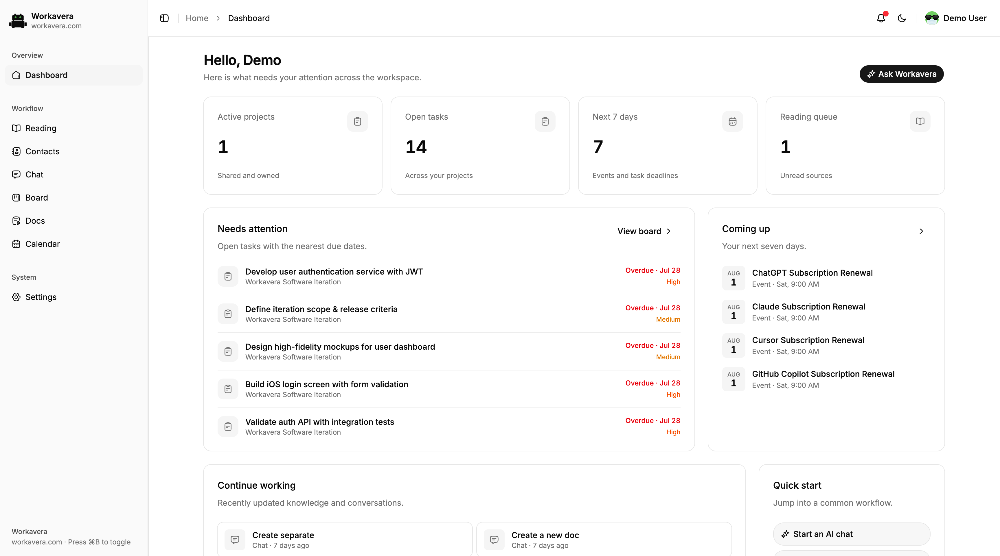
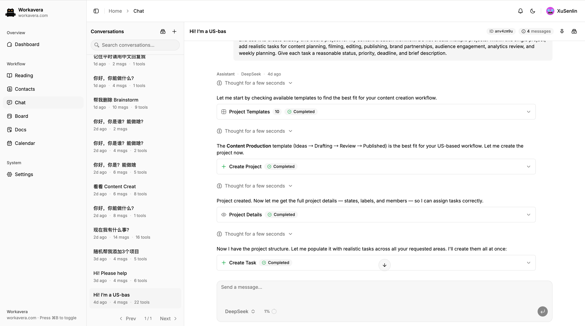
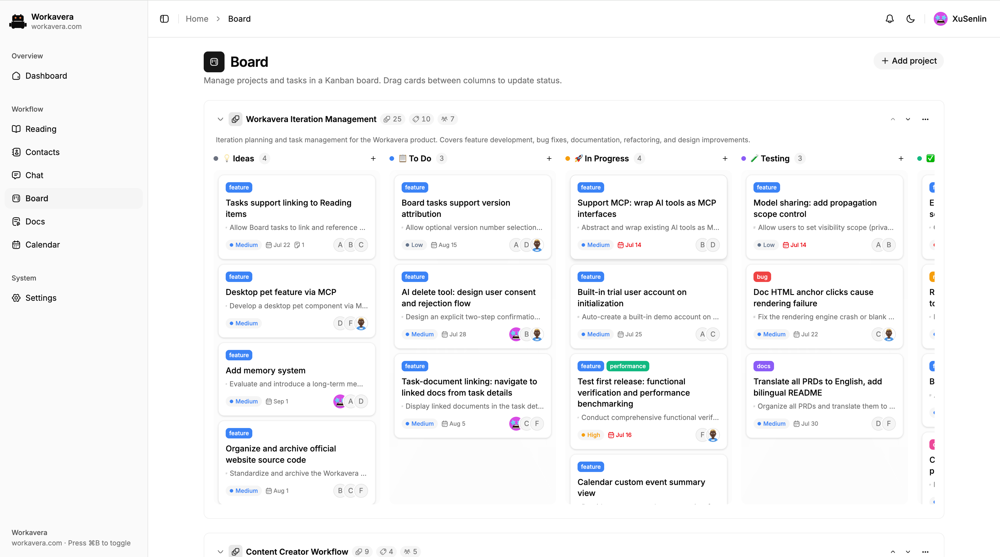
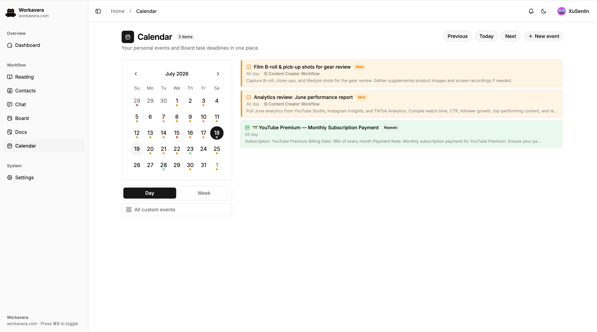
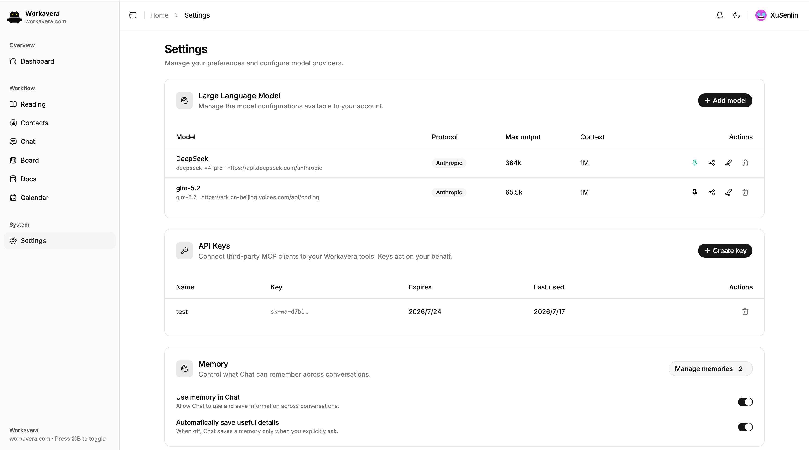

# Workavera

[](./LICENSE)

[简体中文](./README.zh-CN.md)

> **A self-hosted AI workspace for freelancers and small teams** — projects, docs, calendar, and reading in one binary on your own server, with an assistant that can actually operate them, inside your own permissions.

> ⚠️ **Early-stage software (0.0.x).** Features and data schemas are still changing quickly, and releases may include breaking changes (see the [changelog](./CHANGELOG.md)). Back up `pb_data` before upgrading. It is not ready for production use yet.

Workavera keeps your projects, tasks, documents, calendar, saved links, and contacts in one place, and Chat is how you put them in motion: the assistant works through the same capabilities your account already has—finding context, creating and updating records—and the server re-authorizes every action against your own permissions before it is applied.

## Why Workavera

Self-hosted AI tools are a crowded space, and most of them sit on one of two sides:

- **Chat front-ends** (Open WebUI, LibreChat, and similar) put a UI over model APIs. The conversation is the whole product—there is no workspace behind it for the AI to act on.
- **Knowledge workspaces** (AFFiNE, AppFlowy, and similar) manage notes and projects, with AI attached as a writing assistant. The AI suggests text; it doesn't operate the workspace.

Workavera is an attempt at the middle:

- **Permission-aware AI tool calling.** Chat can search your context and operate Board, Calendar, Docs, Reading, and Contacts—but only within the permissions your account already has, and the server re-authorizes every tool call (identity, role, ownership, revision). The AI is never a privileged service account.
- **One self-contained binary.** The frontend is embedded via `go:embed` and data lives in PocketBase/SQLite—no Postgres, Redis, or vector-database stack. Deploy with a single `docker run` or a single downloaded binary.
- **Reachable from the AI tools you already use.** The same tools are exposed over MCP at `/api/mcp`, so clients such as Claude Code and Cursor can work against your workspace with a scoped API key.
- **Bring your own model.** Configure API keys for providers you already pay for. Workavera ships no model and runs no inference of its own, and it is open source under Apache-2.0.

## Screenshots

### Dashboard



### DeepSeek creating a project and calendar plan



### Board



### Calendar



### Bring your own model



## Quick start

No toolchain needed—run the prebuilt image or binary.

### Docker

```bash
docker run -p 8090:8090 -v workavera-data:/app/pb_data ghcr.io/xusenlin/workavera:latest
```

### Prebuilt binary

Download the archive for your platform from [GitHub Releases](https://github.com/xusenlin/workavera/releases), extract it, and start the server from a terminal (it is a server process, so double-clicking the binary is not enough):

```bash
./workavera serve            # workavera.exe serve on Windows
```

By default it listens on <http://127.0.0.1:8090>. Pass `--http=0.0.0.0:8090` to accept connections from other machines.

### First-run setup

1. **Sign in with the demo user.** A fresh data directory automatically gets one application user: `demo@workavera.local` with password `workavera`.
2. **Secure the account.** Change the demo password from Profile before exposing Workavera to other machines or the public internet.
3. **Create the superuser.** PocketBase prints a one-time setup link containing a token, e.g. `http://127.0.0.1:8090/_/#/pbinstal/<token>`. Find it in the terminal output (or in `docker logs` for a detached container), open it, and create the superuser used to manage collections and application users. The superuser itself cannot sign in to Workavera.
4. **Add a model.** In Settings, add at least one model configuration before using Chat or AI summaries.

The demo user is seeded only when the `users` collection is empty, so upgrades do not add or overwrite an account in an existing workspace.

## Product areas

One line each; the [product documentation](#product-documentation) below carries the detail.

- **Board** manages Kanban projects with custom workflow states, labels, members and roles, due dates, task activity history, and ten bilingual project templates.
- **Docs** stores private and project documents with rich-text editing, explicit versions and conflict detection, Markdown/HTML export, and AI editing.
- **Calendar** combines personal events and visible Board deadlines in one view, with recurrence and in-app reminders.
- **Chat** is where you work with the model: durable streaming conversations that survive browser disconnects, with visible reasoning and tool calls, automatic compaction of long conversations, and optional long-term memory that is off by default.
- **Reading** saves external links and notes with projects, tags, read state, and AI summaries.
- **Contacts** provides a searchable team contact list with personal favorites.
- **Dashboard, Notifications, and Settings** cover the workspace overview, the in-app notification inbox, model configuration and sharing, appearance, and profile.

## Development

Only needed when contributing or building from source. Requires Go 1.26.5+, Node.js with [pnpm](https://pnpm.io/), and [Task](https://taskfile.dev/) 3+.

```bash
cd frontend && pnpm install && cd ..   # once

task dev:go     # backend at http://127.0.0.1:8090 (admin UI at /_/)
task dev:ui     # Vite dev server at http://127.0.0.1:5173
task test       # go test ./...
task build      # self-contained binary with the frontend embedded
task release    # cross-compiled release archives in dist/
```

All tasks are defined in [`Taskfile.yml`](./Taskfile.yml); frontend-only commands are documented in [`frontend/README.md`](./frontend/README.md).

## Product documentation

| Module | English | 简体中文 |
| --- | --- | --- |
| Board | [Board PRD](./doc/board-prd.md) | [Board PRD](./doc/board-prd.zh-CN.md) |
| Calendar | [Calendar PRD](./doc/calendar-prd.md) | [Calendar PRD](./doc/calendar-prd.zh-CN.md) |
| Chat | [Chat PRD and Fantasy architecture](./doc/chat-fantasy-plan.md) | [Chat PRD 与 Fantasy 架构](./doc/chat-fantasy-plan.zh-CN.md) |
| Chat Memory | [Chat Memory PRD](./doc/chat-memory-prd.md) | [Chat 记忆 PRD](./doc/chat-memory-prd.zh-CN.md) |
| Docs | [Docs PRD](./doc/docs-prd.md) | [Docs PRD](./doc/docs-prd.zh-CN.md) |

## Changelog

Release history is documented in [CHANGELOG.md](./CHANGELOG.md).

## License

Licensed under the [Apache License 2.0](./LICENSE).

Copyright 2026 xusenlin
