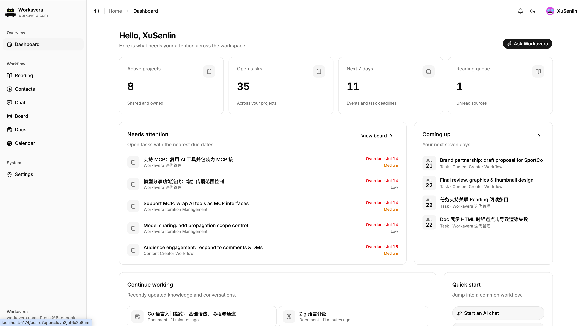
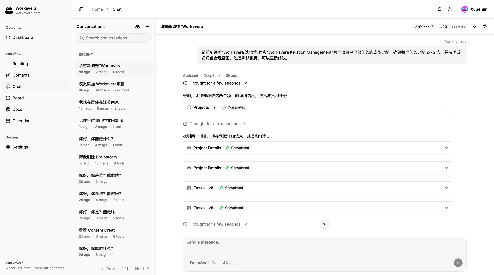
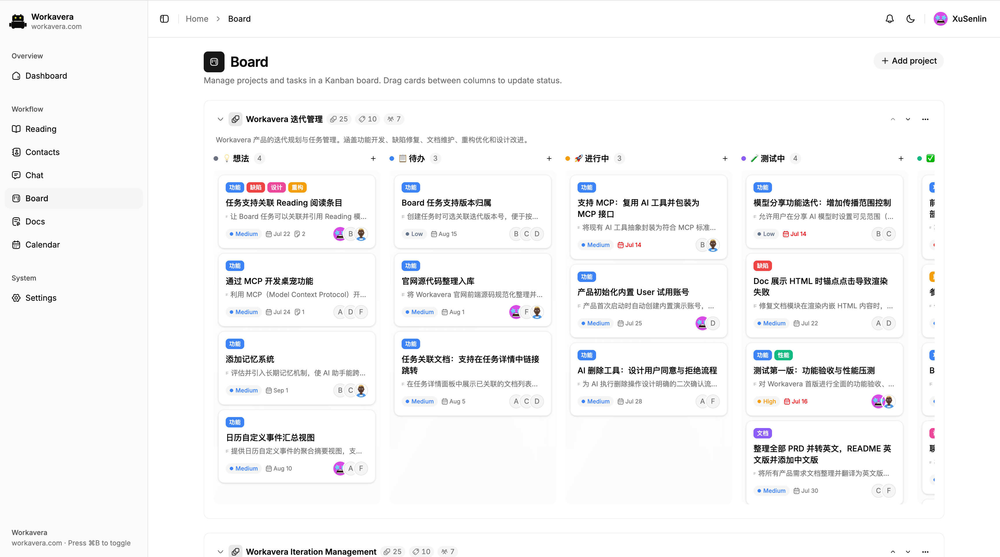
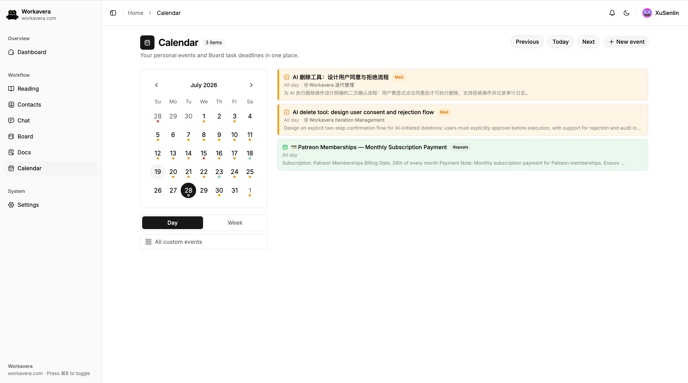
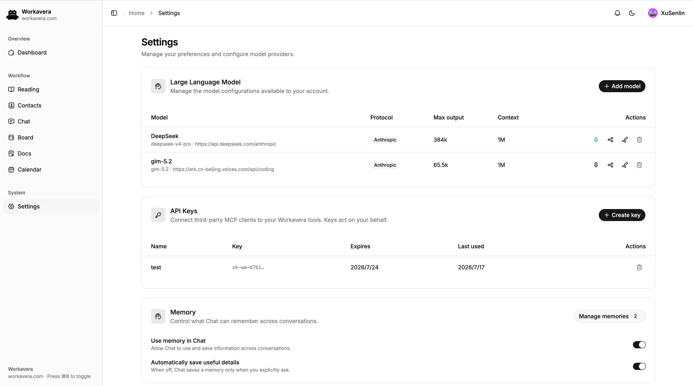

# Workavera

[](./LICENSE)

[English](./README.md)

> **AI 驱动、开源、可自托管的 Slack + Notion + Linear 替代品**——一个二进制跑在你自己的服务器上，数据归你，没有按人头收费的订阅。

> ⚠️ **项目处于早期开发阶段（0.0.x）。** 功能与数据结构仍在快速迭代，版本之间可能包含破坏性变更（见[更新日志](./CHANGELOG.md)），暂不建议用于生产环境。

Workavera 在同一个工作台中连接对话、知识、关系、项目、任务和时间承诺，并通过 Chat 让 AI 推动整个工作区：AI 只能调用你账号本来就有的能力——查找上下文、创建或更新记录——且每次操作在执行前都由服务端按你的权限重新鉴权。

## 为什么选 Workavera

自托管 AI 工具是一个拥挤的赛道，但大多数产品都落在两个阵营之一：

- **Chat 前端**（Open WebUI、LibreChat 等）给模型 API 套一层 UI，对话本身就是全部产品——AI 背后没有可供操作的工作区。
- **知识工作台**（AFFiNE、AppFlowy 等）管理笔记和项目，AI 只是附加的写作助手——AI 能建议文字，但不能操作工作区。

Workavera 把两边结合起来，并补上了双方都没有的那一块：

- **感知权限的 AI 工具调用。** Chat 可以搜索你的上下文，并操作 Board、Calendar、Docs、Reading 和 Contacts——但只限于你账号本来就有的权限范围，且服务端对每次工具调用重新鉴权（身份、角色、所有权、revision）。AI 永远不是一个高权限服务账号。
- **单个自包含二进制。** 前端通过 `go:embed` 内嵌，数据存于 PocketBase/SQLite——不需要 Postgres、Redis 或向量数据库。一条 `docker run` 或一个下载的二进制就能部署。
- **为自由工作者和小团队而建。** 自带模型 API Key，跑在廉价 VPS 或 NAS 上，数据完全归你所有。基于 Apache-2.0 开源。

## 产品截图

### Dashboard 工作概览



### DeepSeek 调用工作区工具



### Board 中文项目看板



### Calendar 统一日程



### 本地模型配置



## 快速开始

无需任何开发工具链，直接运行预构建镜像或二进制即可。

### Docker

```bash
docker run -p 8090:8090 -v workavera-data:/app/pb_data ghcr.io/xusenlin/workavera:latest
```

### 预构建二进制

从 [GitHub Releases](https://github.com/xusenlin/workavera/releases) 下载对应平台的压缩包，解压后在终端中启动（它是一个服务进程，双击运行是不够的）：

```bash
./workavera serve            # Windows 下为 workavera.exe serve
```

默认监听 <http://127.0.0.1:8090>；如需局域网访问，加上 `--http=0.0.0.0:8090`。

### 首次运行

1. **使用 demo 用户登录。** 全新数据目录会自动创建一个应用用户：账号 `demo@workavera.local`，密码 `workavera`。
2. **保护账号安全。** 在将 Workavera 开放给局域网其他设备或公网访问前，请先在 Profile 中修改 demo 用户密码。
3. **创建超级管理员。** PocketBase 会打印一个带 token 的一次性链接，形如 `http://127.0.0.1:8090/_/#/pbinstal/<token>`。在终端输出中找到它（后台运行的容器用 `docker logs` 查看），打开链接并创建用于管理集合和应用用户的超级管理员。超级管理员本身不能登录 Workavera。
4. **配置模型。** 在 Settings 中添加至少一个模型配置后即可使用 Chat 和 AI 总结。

只有当 `users` 集合为空时才会初始化 demo 用户，因此升级已有工作区不会新增账号，也不会覆盖现有账号。

## 产品模块

- **Dashboard** 展示活动项目数、未完成任务数、未来七天事项数和未读 Reading 数量，并提供最近到期任务、即将发生的事件与任务截止事项、最近更新的 Docs/Chat/Reading 记录和快捷入口。
- **Reading** 保存外部网址和笔记，支持关联项目、标签、阅读状态、置顶、归档、总结语言设置和 AI 总结。分页资料库支持搜索及按状态、项目筛选、全部标记为已读，并提供独立的归档恢复与删除操作。
- **Contacts** 提供可搜索的联系人列表、详细资料和个人收藏；Chat 仅搜索有数量限制且不包含敏感字段的联系人摘要。
- **Chat** 将模型输出、推理和工具调用流式写入持久化会话；浏览器断开后运行继续，可恢复连接或停止。输入框旁的上下文指示器展示 token 与缓存明细；长会话接近模型上下文上限时自动压缩为摘要，不改动可见历史。可选的私有长期记忆能够跨会话复用用户允许保存的事实和偏好；该功能默认关闭，自动记录拥有独立开关，用户可随时查看和修改记忆。
- **Docs** 管理个人与项目文档，提供 BlockNote 富文本、源码/全屏模式、Markdown/HTML 导出、明确版本、冲突检测、置顶、归档和 AI 编辑。文档分为 Markdown 与自包含交互式 HTML 应用两种，后者在沙箱中预览。
- **Board** 管理独立的项目流程、标签、角色、任务、活动记录、截止日期和同项目文档关联，并内置十套中英文流程模板。
- **Calendar** 合并个人事件与可见的 Board 截止事项，支持重复和系统时区调度，并生成站内提醒。
- **Notifications** 实时提供模型分享请求、任务到期通知和日历提醒，并支持记录深链接。分页收件箱支持搜索、已读状态与通知类型筛选、置顶、归档恢复和永久删除。
- **Settings 与 Profile** 管理模型配置、模型分享、用户级外观、Chat 记忆开关与已保存记忆、个人资料和头像。

## 开发

以下内容仅在参与开发或从源码构建时需要。环境要求：Go 1.26.5+、Node.js 与 [pnpm](https://pnpm.io/)、[Task](https://taskfile.dev/) 3+。

```bash
cd frontend && pnpm install && cd ..   # 首次执行一次

task dev:go     # 后端 http://127.0.0.1:8090（管理后台 /_/）
task dev:ui     # Vite 开发服务器 http://127.0.0.1:5173
task test       # go test ./...
task build      # 构建内嵌前端的自包含二进制
task release    # 交叉编译发布压缩包到 dist/
```

全部任务定义见 [`Taskfile.yml`](./Taskfile.yml)；前端专用命令见 [`frontend/README.zh-CN.md`](./frontend/README.zh-CN.md)。

## 产品文档

| 模块 | English | 简体中文 |
| --- | --- | --- |
| Board | [Board PRD](./doc/board-prd.md) | [Board PRD](./doc/board-prd.zh-CN.md) |
| Calendar | [Calendar PRD](./doc/calendar-prd.md) | [Calendar PRD](./doc/calendar-prd.zh-CN.md) |
| Chat | [Chat PRD and Fantasy architecture](./doc/chat-fantasy-plan.md) | [Chat PRD 与 Fantasy 架构](./doc/chat-fantasy-plan.zh-CN.md) |
| Chat Memory | [Chat Memory PRD](./doc/chat-memory-prd.md) | [Chat 记忆 PRD](./doc/chat-memory-prd.zh-CN.md) |
| Docs | [Docs PRD](./doc/docs-prd.md) | [Docs PRD](./doc/docs-prd.zh-CN.md) |

## 更新日志

版本历史见 [CHANGELOG.md](./CHANGELOG.md)。

## 许可证

基于 [Apache License 2.0](./LICENSE) 授权。

Copyright 2026 xusenlin
