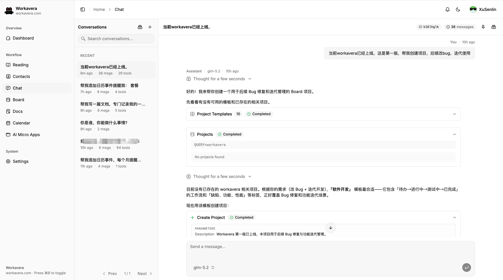
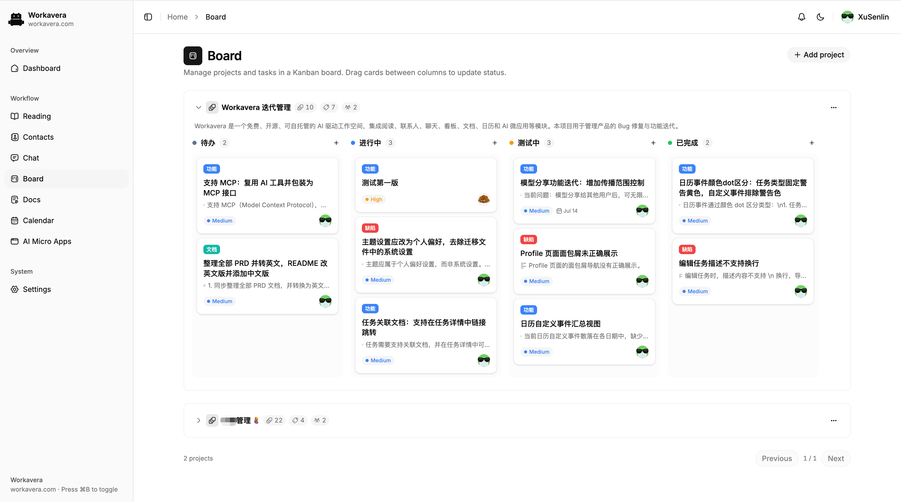

# Workavera

[](./LICENSE)

[English](./README.md)

**一个自包含二进制，一个完整的团队工作台，一个只能做"你本来就能做的事"的 AI——每次 AI 操作都由服务端按你自己的权限重新鉴权。**

Workavera 是一个可自托管的 AI 团队工作台，在同一个应用中连接对话、知识、关系、项目、任务和时间承诺。

**通过 Chat，让 AI 推动整个工作区。** AI 可以在你已有权限范围内调用工作区能力，查找上下文，并创建或更新受支持的记录；它不会获得超出你本人权限的访问能力。每项操作在真正执行前都会由服务端重新鉴权。

后端使用 Go 与 PocketBase，前端使用 Vite、React 与 TypeScript。编译后的前端资源通过 `go:embed` 内嵌进 Go 二进制，由同一个 PocketBase 进程提供，因此发布产物是单个自包含的可执行文件。

## 为什么选 Workavera

自托管 AI 工具是一个拥挤的赛道，但大多数产品都落在两个阵营之一：

- **Chat 前端**（Open WebUI、LibreChat 等）给模型 API 套一层 UI，对话本身就是全部产品——AI 背后没有可供操作的工作区。
- **知识工作台**（AFFiNE、AppFlowy 等）管理笔记和项目，AI 只是附加的写作助手——AI 能建议文字，但不能操作工作区。

Workavera 把两边结合起来，并补上了双方都没有的那一块：

- **感知权限的 AI 工具调用。** Chat 可以搜索你的上下文，并操作 Board、Calendar、Docs、Reading、Contacts 和 AI Micro Apps——但只限于你账号本来就有的权限范围，且服务端对每次工具调用重新鉴权（身份、角色、所有权、revision）。AI 永远不是一个高权限服务账号。
- **单个自包含二进制。** 前端通过 `go:embed` 内嵌，数据存于 PocketBase/SQLite——不需要 Postgres、Redis 或向量数据库。一条 `docker run` 或一个下载的二进制就能部署。
- **为自由工作者和小团队而建。** 自带模型 API Key，跑在廉价 VPS 或 NAS 上，数据完全归你所有。基于 Apache-2.0 开源。

## 产品截图

### Chat 与工作区工具



### Board 任务详情



## 快速开始

无需任何开发工具链，直接运行预构建镜像或二进制即可。

### Docker

```bash
docker run -p 8090:8090 -v workavera-data:/app/pb_data ghcr.io/xusenlin/workavera:latest
```

### 预构建二进制

从 [GitHub Releases](https://github.com/xusenlin/workavera/releases) 下载对应平台的压缩包，解压后在终端中启动（它是一个服务进程，双击运行是不够的）：

```bash
./workavera serve            # Windows 下为 workavera.exe serve
```

默认监听 <http://127.0.0.1:8090>；如需局域网访问，加上 `--http=0.0.0.0:8090`。

### 首次运行

1. **创建超级管理员。** 首次启动时，PocketBase 会打印一个带 token 的一次性链接，形如 `http://127.0.0.1:8090/_/#/pbinstal/<token>`。在终端输出中找到它（后台运行的容器用 `docker logs` 查看），在浏览器中打开并创建超级管理员账号。
2. **创建应用用户。** 在管理后台 <http://127.0.0.1:8090/_/> 的 `users` 集合中添加一条记录。Workavera 登录页只接受这样由管理员创建的账号——超级管理员本身不能登录应用。
3. **登录并配置模型。** 打开 <http://127.0.0.1:8090>，用该用户登录，在 Settings 中添加至少一个模型配置后即可使用 Chat 和 AI 总结。

## 产品模块

- **Dashboard** 展示活动项目数、未完成任务数、未来七天事项数和未读 Reading 数量，并提供最近到期任务、即将发生的事件与任务截止事项、最近更新的 Docs/Chat/Reading 记录和快捷入口。
- **Reading** 保存外部网址和笔记，支持关联项目、标签、阅读状态、置顶、归档、总结语言设置和 AI 总结。
- **Contacts** 提供可搜索的联系人列表、详细资料和个人收藏；Chat 仅搜索有数量限制且不包含敏感字段的联系人摘要。
- **Chat** 将模型输出、推理和工具调用流式写入持久化会话；浏览器断开后运行继续，可恢复连接或停止。
- **Docs** 管理个人与项目 Markdown 文档，提供 Milkdown 富文本、Source/Diff/全屏模式、明确版本、冲突检测、置顶、归档和 AI 编辑。
- **Board** 管理独立的项目流程、标签、角色、任务、活动记录、截止日期和同项目文档关联，并内置十套中英文流程模板。
- **Calendar** 合并个人事件与可见的 Board 截止事项，支持重复和系统时区调度，并生成站内提醒。
- **AI Micro Apps** 管理自包含 HTML 工具与原型，支持沙箱预览、置顶、归档/恢复，以及用于生成和修改 HTML 的 Assistant 工具。
- **Notifications** 实时提供模型分享请求、任务到期通知和日历提醒，并支持记录深链接。
- **Settings 与 Profile** 管理模型配置、模型分享、用户级外观、个人资料和头像。

Reading 是外部信息输入层，Docs 是可复用知识层，Board 是行动层，Calendar 是时间承诺层，AI Micro Apps 是交互式交付层。

Chat 将这些模块连接成感知权限的 AI 操作入口，可以搜索当前用户可见的上下文，并调用 Board、Calendar、Reading、Docs、Contacts 和 AI Micro Apps 已注册的工具。工具能力不会绕过产品规则：每次操作都由后端校验身份、角色、所有权、关联关系和 revision。

## 技术栈

- Go 1.26.4
- PocketBase 0.39.4
- Fantasy 0.35.0
- React 19、TypeScript 6、Vite 8
- Tailwind CSS 4 与本地 shadcn/ui 组件
- AI SDK UI 消息流
- Zustand 与 PocketBase JavaScript SDK
- Milkdown Crepe Markdown 编辑器

## 数据与安全说明

- 运行数据位于 `pb_data/`，不会提交到 Git。
- 模型 API Key 保存在隐藏的 `llm_models.api_key` 字段中，只通过认证服务端接口访问。
- 用户记录由 PocketBase 规则和服务端领域校验共同保护。
- Chat 历史由服务端加载，浏览器不提供权威的历史消息。
- 活动 Chat 运行保存在当前进程中。同一服务进程存活时可以恢复流；生产多实例执行需要共享的持久运行基础设施。
- Calendar 调度和提醒使用 `configs/system.timezone`。

## 开发

以下内容仅在参与开发或从源码构建时需要——如果只是想运行 Workavera，请看[快速开始](#快速开始)。

### 环境要求

- Go 1.26.4 或更高版本
- Node.js 与 [pnpm](https://pnpm.io/)
- [Task](https://taskfile.dev/) 3 或更高版本
- 仅在构建或发布容器时需要 Docker 与 Buildx

### 本地开发

首次安装前端依赖：

```bash
cd frontend
pnpm install
cd ..
```

在两个终端中分别运行后端和 Vite 前端：

```bash
task dev:go
```

```bash
task dev:ui
```

打开 <http://127.0.0.1:5173>。Vite 会将 `/api` 代理到 <http://127.0.0.1:8090> 的 PocketBase。

PocketBase 还提供：

- 管理后台：<http://127.0.0.1:8090/_/>
- 健康检查：<http://127.0.0.1:8090/api/health>

首次启动时服务端会打印[首次运行](#首次运行)中描述的一次性超级管理员设置链接，按同样方式创建超级管理员和应用用户。登录后，使用 Chat 或 AI 总结前需要在 Settings 中添加至少一个模型配置。

`task dev:go` 使用 `go run` 启动时会启用 PocketBase 自动迁移，并将结构变化写入 `migrations/`。

### 构建与运行

构建前端和后端：

```bash
task build:ui
task build:go
```

前端构建完成后运行打包应用：

```bash
task run
```

打开 <http://127.0.0.1:8090>。`task run` 会重新构建 Go 二进制，并将当前的 `frontend/dist` 内嵌进去，产出完全自包含的可执行文件。

版本来自 [`VERSION`](./VERSION)，并在构建时注入二进制。查看版本：

```bash
./workavera --version
```

### 常用命令

| 命令 | 用途 |
| --- | --- |
| `task dev:go` | 启动 Go/PocketBase 开发服务器 |
| `task dev:ui` | 启动 Vite 开发服务器 |
| `task build:ui` | 类型检查并构建 `frontend/dist` |
| `task build:go` | 构建 `workavera` 二进制（内嵌 `frontend/dist`） |
| `task build` | 构建前端并打包自包含二进制 |
| `task release` | 交叉编译并打包 Linux/macOS/Windows 三平台发布压缩包到 `dist/` |
| `task run` | 构建并运行 Go 二进制 |
| `task build:docker` | 构建前端和本地 `ghcr.io/xusenlin/workavera:latest` 镜像 |
| `task push` | 构建并推送 `linux/amd64` 版本镜像与 `latest` 镜像 |
| `task test` | 运行 `go test ./...` |
| `task tidy` | 运行 `go mod tidy` |

前端专用命令见 [`frontend/README.zh-CN.md`](./frontend/README.zh-CN.md)。

### 二进制发布

为 GitHub 发布交叉编译自包含二进制：

```bash
task release
```

该命令会构建并内嵌前端，然后交叉编译三个平台的产物到 `dist/`，打包为压缩包，命名包含版本、操作系统与架构：

- `dist/workavera_<版本>_linux_amd64.tar.gz`
- `dist/workavera_<版本>_darwin_arm64.tar.gz`
- `dist/workavera_<版本>_windows_amd64.zip`

每个压缩包内是单个自包含的 `workavera` 二进制（Windows 为 `workavera.exe`）——运行时无需额外的前端资源。同时会生成 `dist/SHA256SUMS.txt` 校验文件。`dist/` 目录已加入 git 忽略。

### Docker 镜像

构建本地镜像：

```bash
task build:docker
```

容器使用非 root 用户运行，包含 CA 证书和时区数据，提供健康检查，将数据保存在 `/app/pb_data`，前端资源已内嵌于单个自包含二进制中。运行命令见[快速开始](#快速开始)。

`task push` 使用 `VERSION` 中的值，为 `linux/amd64` 同时发布 `:<version>` 和 `:latest`。

## 项目结构

```text
.
├── workavera.go                 # PocketBase 入口与前端资源服务
├── internal/
│   ├── agent/                   # Fantasy 与 AI SDK 流适配
│   ├── assistant/tools/         # 按用户创建的工作区工具
│   ├── board/                   # 项目、任务、角色、校验和活动
│   ├── calendar/                # 事件、重复和日程查询
│   ├── chat/                    # 会话、运行、SSE 和持久化
│   ├── configs/                 # 系统配置 API
│   ├── contacts/                # 联系人与安全 Assistant 查询
│   ├── docs/                    # Markdown 文档与版本
│   ├── llm/                     # 模型设置与分享
│   ├── microapps/               # AI Micro Apps 与预览
│   ├── notifications/           # 实时通知与调度器
│   └── reading/                 # Reading 资料库与总结
├── migrations/                  # PocketBase 结构迁移与测试
├── frontend/                    # Vite React 应用
│   └── src/
│       ├── components/          # 功能组件与 UI 组件
│       ├── pages/               # 路由页面
│       ├── store/               # Zustand Store
│       └── lib/                 # PocketBase 与共享工具
├── doc/                         # 中英文产品文档
├── Dockerfile
├── Taskfile.yml
└── VERSION
```

## 产品文档

| 模块 | English | 简体中文 |
| --- | --- | --- |
| Board | [Board PRD](./doc/board-prd.md) | [Board PRD](./doc/board-prd.zh-CN.md) |
| Calendar | [Calendar PRD](./doc/calendar-prd.md) | [Calendar PRD](./doc/calendar-prd.zh-CN.md) |
| Chat | [Chat PRD and Fantasy architecture](./doc/chat-fantasy-plan.md) | [Chat PRD 与 Fantasy 架构](./doc/chat-fantasy-plan.zh-CN.md) |
| Docs | [Docs PRD](./doc/docs-prd.md) | [Docs PRD](./doc/docs-prd.zh-CN.md) |

## 更新日志

版本历史见 [CHANGELOG.md](./CHANGELOG.md)。

## 许可证

基于 [Apache License 2.0](./LICENSE) 授权。

Copyright 2026 xusenlin
