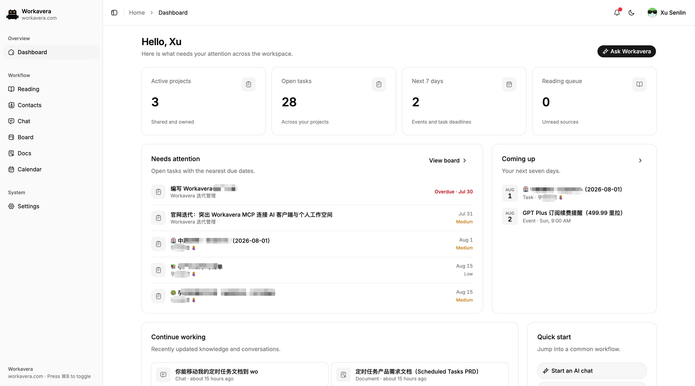
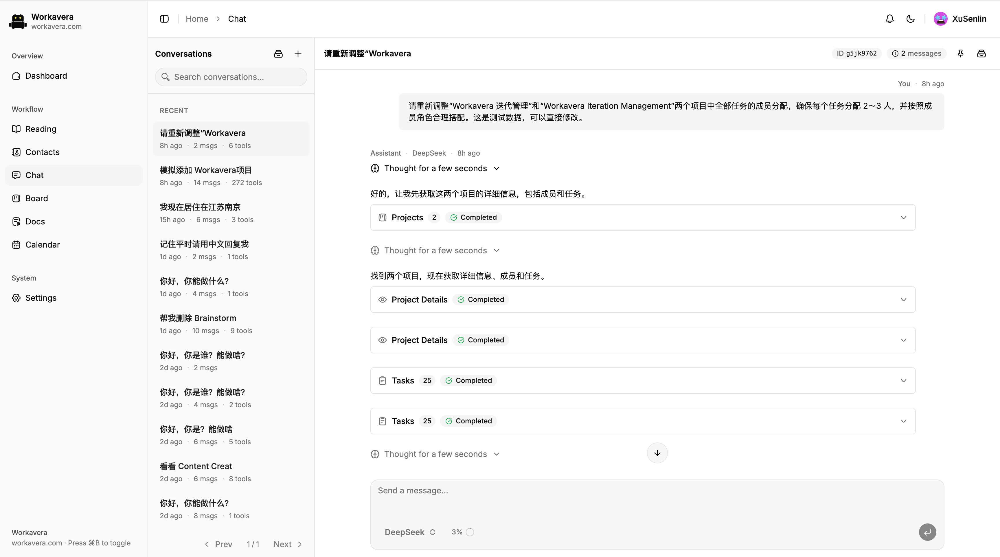
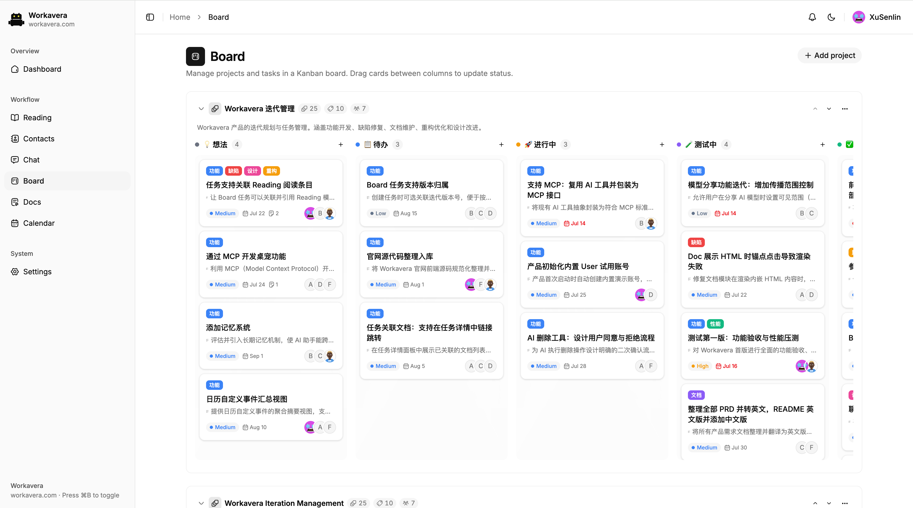
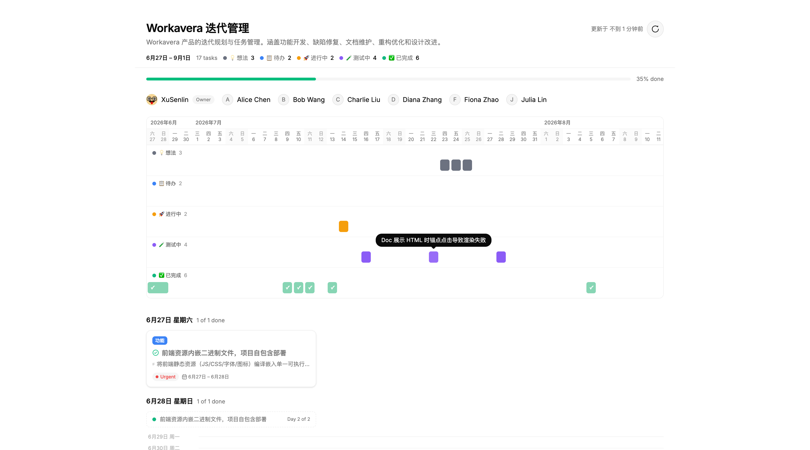
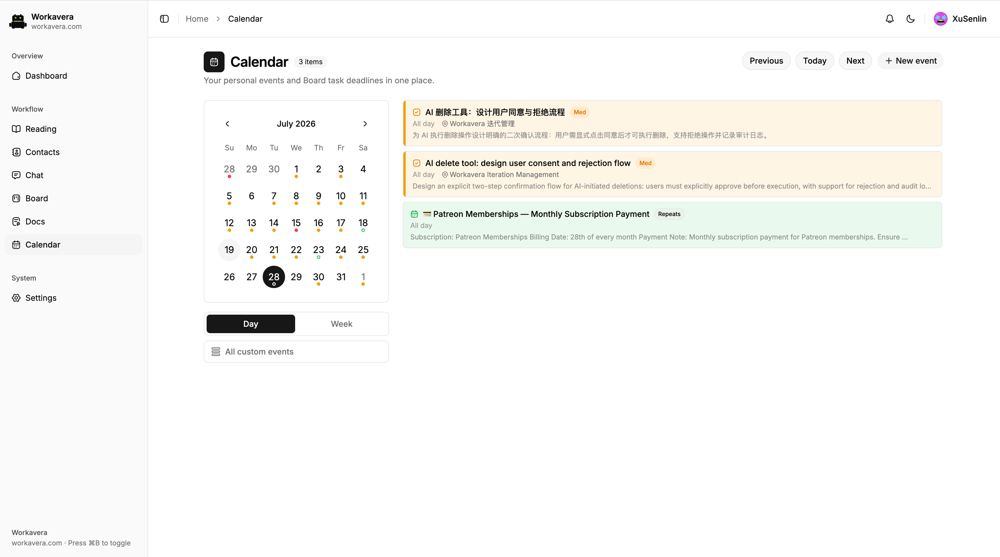
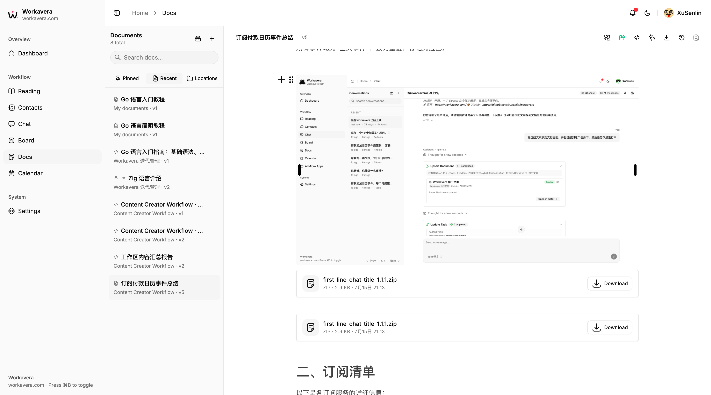
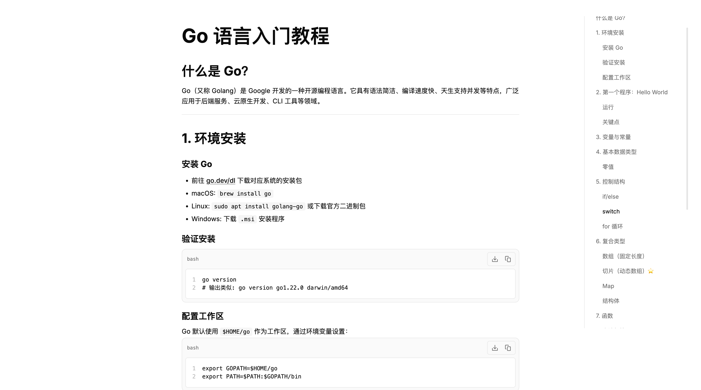
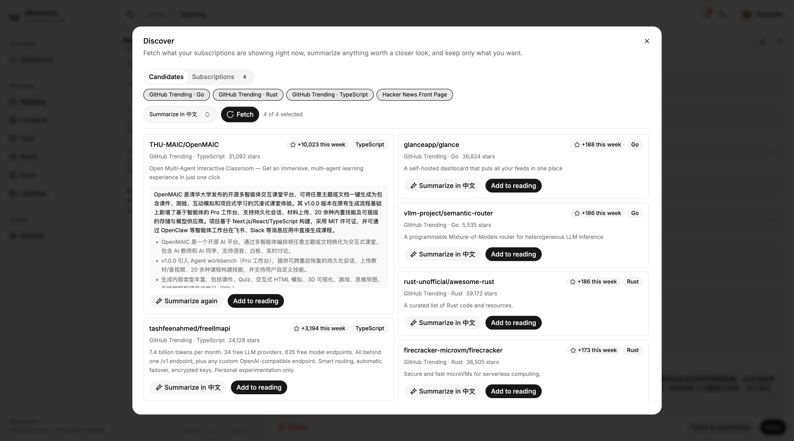
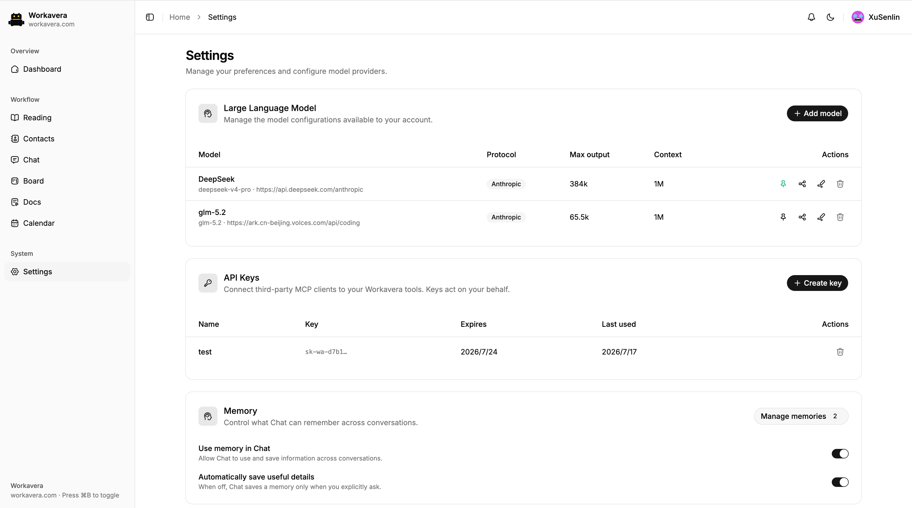

# Workavera

[](./LICENSE)

[English](./README.md)

> **面向自由职业者与小团队的自托管 AI 工作区**——项目、文档、日历、稍后读装进一个二进制，跑在你自己的服务器上；AI 能真正动手操作它们，且始终在你自己的权限范围内。

> ⚠️ **项目处于早期开发阶段（0.x）。** 功能与数据结构仍在快速迭代，版本之间可能包含破坏性变更（见[更新日志](./CHANGELOG.md)），升级前请备份 `pb_data`，暂不建议用于生产环境。

Workavera 把你的项目、任务、文档、日历、收藏链接和联系人放在同一个工作台里，并通过 Chat 让它们动起来：AI 只能调用你账号本来就有的能力——查找上下文、创建或更新记录——且每次操作在执行前都由服务端按你的权限重新鉴权。

## 为什么选 Workavera

自托管 AI 工具是一个拥挤的赛道，大多数产品都落在两个阵营之一：

- **Chat 前端**（Open WebUI、LibreChat 等）给模型 API 套一层 UI，对话本身就是全部产品——AI 背后没有可供操作的工作区。
- **知识工作台**（AFFiNE、AppFlowy 等）管理笔记和项目，AI 只是附加的写作助手——AI 能建议文字，但不能操作工作区。

Workavera 尝试站在两者中间：

- **感知权限的 AI 工具调用。** Chat 可以搜索你的上下文，并操作 Board、Calendar、Docs、Reading 和 Contacts——但只限于你账号本来就有的权限范围，且服务端对每次工具调用重新鉴权（身份、角色、所有权、revision）。AI 永远不是一个高权限服务账号。
- **单个自包含二进制。** 前端通过 `go:embed` 内嵌，数据存于 PocketBase/SQLite——不需要 Postgres、Redis 或向量数据库。一条 `docker run` 或一个下载的二进制就能部署。
- **可以从你已有的 AI 工具接入。** 同一批工具通过 MCP 暴露在 `/api/mcp`，Claude Code、Cursor 等客户端可以用带权限范围的 API Key 直接操作你的工作区。
- **自带模型。** 配置你已经在付费的服务商 API Key 即可，也可以把 Chat 指向跑在你自己硬件上的模型；Workavera 不内置模型，也不自行推理，基于 Apache-2.0 开源。

## 数据隐私

自托管本身已经解决了大半：项目、任务、文档、日历、稍后读、联系人以及完整的对话记录，全部存在你自己机器上的 `pb_data` SQLite 文件里。Workavera 没有任何遥测，也没有厂商后端。唯一会离开这台服务器的流量，都是你自己配置出来的——你在 Settings 里添加的模型服务商，以及你自己接入的外部 MCP 服务。

模型调用通常是最后一份交给第三方的数据，而这一份同样可以留在本地。本地推理服务在 Settings 里的添加方式和在线服务商完全一样，且四种协议都可以用于本地——OpenAI、OpenAI 兼容、Anthropic Messages、Google——所以 LM Studio、Ollama、vLLM、llama.cpp 都能接；按你的推理服务实际暴露的端点选协议即可。

| 字段 | 值 |
| --- | --- |
| 协议 | 按推理服务暴露的端点选。LM Studio 同时提供 OpenAI 兼容与 Anthropic 兼容端点，Ollama 提供 OpenAI 兼容端点 |
| Base URL | 服务地址，Anthropic 协议填 `http://127.0.0.1:1234`，OpenAI 系协议填 `http://127.0.0.1:1234/v1`（Ollama 端口为 11434） |
| Model ID | 推理服务报告的模型名，例如 `qwen/qwen3.8-27b` |
| API Key | 留空即可，本地服务不校验 |

这条路是实际支持的，不是纸面选项。一台 Apple 芯片 Mac 上用 LM Studio 跑 27B 级别的本地模型（Qwen3.8 27B，MLX 4bit，磁盘占用约 16 GB），经由它的 Anthropic 兼容端点接入，足以完整驱动 Chat：多轮推理、调用 Board / Calendar / Docs / Reading 的工作区工具，以及在此之上的外部 MCP 工具。这种配置下，整条链路——你的工作区数据、由它拼装出的提示词、工具返回的结果——都留在你自己的硬件上，拔掉网线 Workavera 依然能用。

依赖它之前有两点需要知道：

- **模型变小时，最先崩掉的是工具调用。** 回答质量随模型缩小是平滑下降的，而“连续多轮都能输出格式正确的工具调用”这件事不是。请优先选择工具调用能力扎实的模型；27B 的 4bit 量化大约需要 16 GB 空闲内存。
- **本地模型并不会让外部 MCP 服务也变成本地的。** 如果你接入了托管的 MCP 服务（比如联网搜索），模型发给它的参数仍然会离开你的机器。

Base URL 是由 Workavera 服务端发起请求的，不是浏览器。如果 Workavera 跑在容器里、且容器的网络模式看不到宿主机的 `127.0.0.1`，把地址换成 `http://host.docker.internal:1234` 即可。

## 产品截图

### Dashboard 工作概览



### DeepSeek 调用工作区工具



### Board 中文项目看板



### Board 公开时间线



### Calendar 统一日程



### Docs 文档编辑器



### 文档公开分享



### Discover 订阅发现与 AI 总结



### 本地模型配置



## 移动客户端预告

Workavera 原生 Android 和 iOS 客户端正在积极开发中。它们会直接连接你的
Workavera 自托管服务，无需通过额外的第三方服务，即可在手机和平板上访问工作区。

- **[从 GitHub Releases 下载 Workavera Android 客户端](https://github.com/xusenlin/workavera-android/releases/latest)。**
  客户端使用 Kotlin 与 Jetpack Compose 开发，[源码](https://github.com/xusenlin/workavera-android)
  已开源。
- **[前往 App Store 获取 Workavera iOS 客户端](https://apps.apple.com/app/workavera/id6794339518)。**
  原生 SwiftUI 客户端适配 iPhone 与 iPad，源码暂未开放，稍后开源。

两个客户端目前均为早期预览版，部分功能仍在开发中，功能进度可能暂时落后于 Web 版。

### 服务端版本要求

客户端直接访问服务端的数据集合，因此服务端必须新到拥有客户端会查询的那些集合。
升级顺序是先升服务端，再升客户端。

| Android / iOS | 要求服务端 | 原因 |
| --- | --- | --- |
| 1.0.2 | 0.0.10 及以上 | 任务归档需要 `board_tasks.archived` |
| 1.0.1 | 0.0.9 及以上 | 自建 MCP 服务需要 `mcp_servers` |

服务端更新后旧版客户端仍可使用，只是用不到它不认识的能力：1.0.2 之前的客户端
不会过滤归档任务，归档后的任务仍会显示在它的看板里。

## 快速开始

无需任何开发工具链，直接运行预构建镜像或二进制即可。

### Docker

```bash
docker run -p 8090:8090 -v workavera-data:/app/pb_data ghcr.io/xusenlin/workavera:latest
```

### 预构建二进制

从 [GitHub Releases](https://github.com/xusenlin/workavera/releases) 下载对应平台的压缩包，解压后在终端中启动（它是一个服务进程，双击运行是不够的）：

```bash
./workavera serve            # Windows 下为 workavera.exe serve
```

默认监听 <http://127.0.0.1:8090>；如需局域网访问，加上 `--http=0.0.0.0:8090`。

### 首次运行

1. **使用 demo 用户登录。** 全新数据目录会自动创建一个应用用户：账号 `demo@workavera.local`，密码 `workavera`。
2. **保护账号安全。** 在将 Workavera 开放给局域网其他设备或公网访问前，请先在 Profile 中修改 demo 用户密码。
3. **创建超级管理员。** PocketBase 会打印一个带 token 的一次性链接，形如 `http://127.0.0.1:8090/_/#/pbinstal/<token>`。在终端输出中找到它（后台运行的容器用 `docker logs` 查看），打开链接并创建用于管理集合和应用用户的超级管理员。超级管理员本身不能登录 Workavera。
4. **配置模型。** 在 Settings 中添加至少一个模型配置后即可使用 Chat 和 AI 总结。

只有当 `users` 集合为空时才会初始化 demo 用户，因此升级已有工作区不会新增账号，也不会覆盖现有账号。

## 产品模块

每个模块只写一句，详细内容见下方的[产品文档](#产品文档)。

- **Board** 管理看板项目，支持自定义流程状态、标签、成员与角色、截止日期、任务活动记录，并内置十套中英文项目模板。
- **Docs** 管理个人与项目文档，提供富文本编辑、明确版本与冲突检测、Markdown/HTML 导出、AI 编辑，以及把某一版发布为公开链接、让没有账号的人也能阅读。
- **Calendar** 在同一视图中合并个人事件与可见的 Board 截止事项，支持重复日程和站内提醒。
- **Chat** 是你和模型协作的地方：持久化的流式会话，浏览器断开后运行继续，展示推理与工具调用，长会话自动压缩，并提供默认关闭的长期记忆。
- **Reading** 保存外部链接和笔记，支持关联项目、标签、阅读状态和 AI 总结。
- **Contacts** 提供可搜索的团队联系人列表和个人收藏。
- **Dashboard、Notifications 与 Settings** 分别负责工作概览、站内通知收件箱，以及模型配置与分享、外观和个人资料。

## 开发

以下内容仅在参与开发或从源码构建时需要。环境要求：Go 1.26.5+、Node.js 与 [pnpm](https://pnpm.io/)、[Task](https://taskfile.dev/) 3+。

```bash
cd frontend && pnpm install && cd ..   # 首次执行一次

task dev:go     # 后端 http://127.0.0.1:8090（管理后台 /_/）
task dev:ui     # Vite 开发服务器 http://127.0.0.1:5173
task test       # go test ./...
task build      # 构建内嵌前端的自包含二进制
task release    # 交叉编译发布压缩包到 dist/
```

全部任务定义见 [`Taskfile.yml`](./Taskfile.yml)；前端专用命令见 [`frontend/README.zh-CN.md`](./frontend/README.zh-CN.md)。

## 产品文档

| 模块 | English | 简体中文 |
| --- | --- | --- |
| Board | [Board PRD](./doc/board-prd.md) | [Board PRD](./doc/board-prd.zh-CN.md) |
| Board 公开预览 | [Board Public Preview PRD](./doc/board-public-preview-prd.md) | [Board 公开预览 PRD](./doc/board-public-preview-prd.zh-CN.md) |
| Calendar | [Calendar PRD](./doc/calendar-prd.md) | [Calendar PRD](./doc/calendar-prd.zh-CN.md) |
| Chat | [Chat PRD and Fantasy architecture](./doc/chat-fantasy-plan.md) | [Chat PRD 与 Fantasy 架构](./doc/chat-fantasy-plan.zh-CN.md) |
| Chat Memory | [Chat Memory PRD](./doc/chat-memory-prd.md) | [Chat 记忆 PRD](./doc/chat-memory-prd.zh-CN.md) |
| Docs | [Docs PRD](./doc/docs-prd.md) | [Docs PRD](./doc/docs-prd.zh-CN.md) |

## 更新日志

版本历史见 [CHANGELOG.md](./CHANGELOG.md)。

## 许可证

基于 [Apache License 2.0](./LICENSE) 授权。

Copyright 2026 xusenlin
